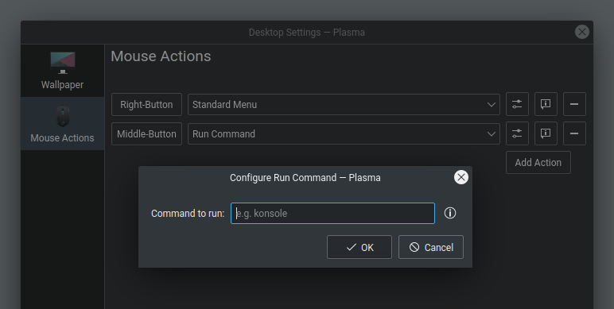

# Plasma Desktop Run Command

This is a simple plugin for KDE Plasma which allows running a custom command, by invoking a specified mouse action on the desktop area. To give you an example, such feature may be useful if you want to run third-party application launchers, or to quickly spawn Konsole with a single click, or to launch a custom script, etc.

## Table of Contents

- [Screenshot](#screenshot)
- [Installation](#installation)
  - [Packages](#packages)
  - [From source](#from-source)
- [Configuration](#configuration)
- [License](#license)
- [Changelog](#changelog)

## Screenshot



## Installation

### Packages

Ubuntu, Fedora and openSUSE Tumbleweed users can visit the [releases section](https://github.com/wsdfhjxc/plasma-desktop-run-command/releases).

**Note**: The minimum supported distro's version is indicated in the filename of a given package.

At the moment, there are no maintained repositories, or prebuilt packages for other Linux distributions.

### From source

#### Dependencies

- g++
- cmake
- extra-cmake-modules
- qtbase5-dev
- libkf5plasma-dev

#### Latest git version

```
./helper.sh install
```

#### Specific release version

```
git checkout 1.0
git checkout master -- helper.sh
./helper.sh install
```

**Note**: To uninstall the plugin, run: `./helper.sh uninstall`

## Configuration

1. Open the Desktop Settings and the Mouse Actions tab
2. Click the Add Action button, so it'll turn into the Input Here button
3. Assign an action event by interacting with the button:
    - press the right mouse button,
    - or press the mouse wheel button,
    - or scroll the mouse wheel up or down
4. Select Run Command from the list
5. Click a button to open the configuration dialog
6. Enter the command to be run when the event occurs
7. Click OK and then Apply in the parent configuration dialog

**Note**: As for the body of the command, for a mouse wheel scroll action you can also use the `$SCROLL` variable, that has either "UP" or "DOWN" value, and which can be, for example, passed as an input argument for a script.

## License

[GNU General Public License v3.0](LICENSE)

## Changelog

Changes are listed [here](CHANGELOG.md) and in the [releases section](https://github.com/wsdfhjxc/plasma-desktop-run-command/releases).
